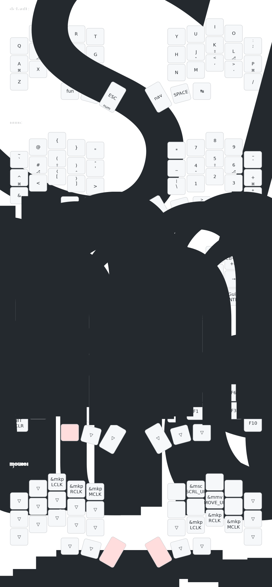

# Dance ZMK Config

This is my personal ZMK config for the [dance](https://github.com/chase-hunter/dance).

Some notes about this config:
- Four main layers (default, numbers/symbols, navigation, and function)
- Navigation layer has vim-like arrow keys

